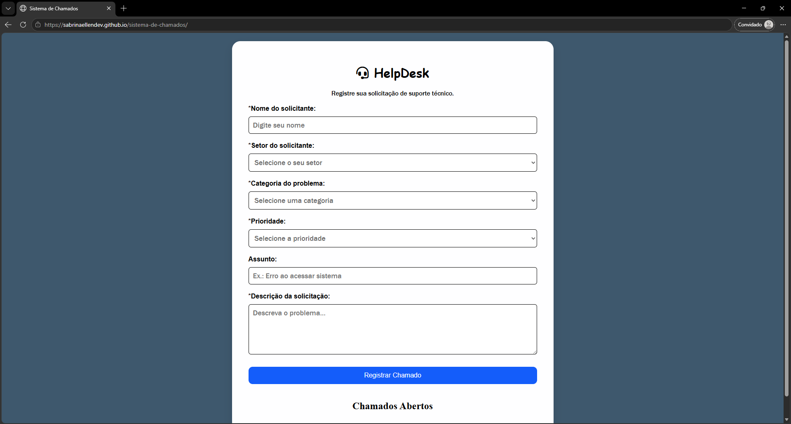
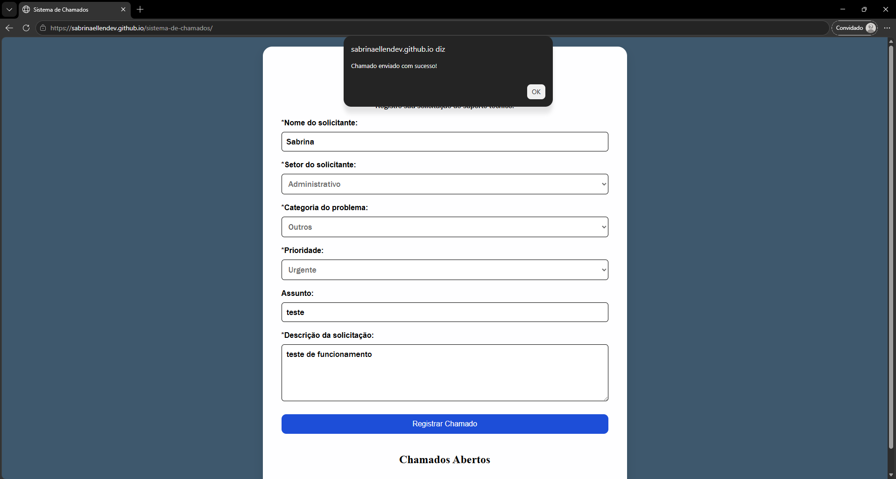

# Sistema Web de Chamados

Sistema web de abertura e registro de chamados de suporte técnico, desenvolvido com HTML, CSS, JavaScript, Node.js, Express e MySQL.

O projeto simula um sistema de Help Desk, permitindo que usuários registrem solicitações de suporte de forma organizada, informando dados como categoria, prioridade e descrição do problema.

Os chamados são enviados para uma API desenvolvida em Node.js e armazenados em um banco de dados MySQL.

## Acesso ao projeto

Você pode visualizar a interface do sistema online:

https://sabrinaellendev.github.io/sistema-de-chamados/

## Tecnologias utilizadas

### Front-end

- HTML5
- CSS3
- JavaScript

### Back-end

- Node.js
- Express
- API REST

### Banco de dados

- MySQL

## Funcionalidades

- Abertura de chamados de suporte técnico
- Validação de campos obrigatórios
- Seleção de categoria do problema
- Definição de prioridade do chamado
- Geração automática de status inicial
- Envio dos dados para uma API
- Armazenamento dos chamados em banco de dados MySQL
- Organização das informações cadastradas

## Funcionamento

O usuário preenche o formulário de abertura de chamado.

O JavaScript captura os dados inseridos e envia uma requisição para a API desenvolvida em Node.js.

A API recebe as informações enviadas pelo sistema e realiza a inserção dos dados no banco de dados MySQL.

Cada chamado contém:

- ID
- Solicitante
- Setor
- Categoria
- Prioridade
- Assunto
- Descrição
- Status
- Data de abertura

## Objetivo

Este projeto foi desenvolvido com o objetivo de praticar conceitos de desenvolvimento Web Full Stack, criando uma aplicação com comunicação entre interface, API e banco de dados.

Conceitos aplicados:

- Manipulação do DOM
- Eventos em JavaScript
- Objetos e arrays
- Template Strings
- Consumo de API utilizando Fetch
- Criação de API REST com Express
- Integração com banco de dados MySQL
- Operações SQL de inserção de dados
- Organização de projetos Front-end e Back-end

## Demonstração do projeto

### Tela inicial

### Chamado enviado

### Chamados abertos

