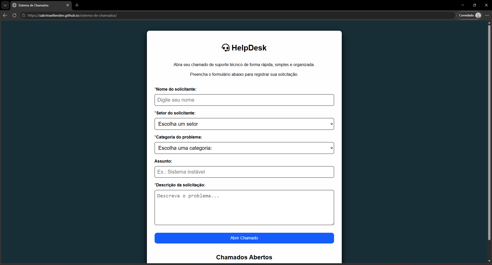
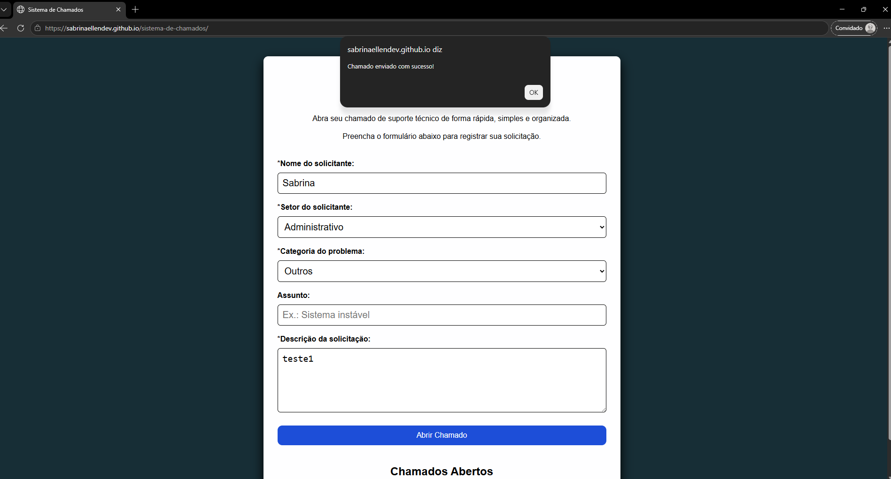
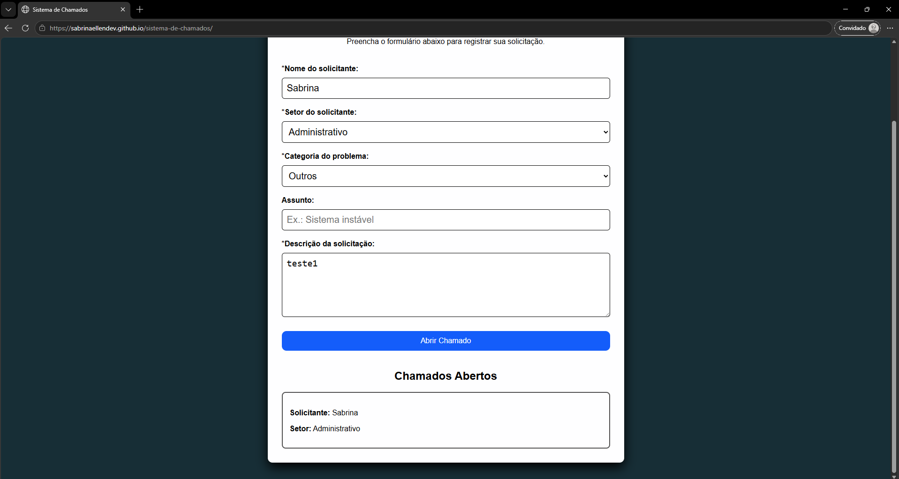

# Sistema Web de Chamados

Sistema web para abertura de chamados de suporte técnico, desenvolvido com HTML, CSS e JavaScript. O projeto permite registrar solicitações de atendimento de forma simples e organizada.

## Acesso ao projeto

Você pode visualizar o sistema online:

https://sabrinaellendev.github.io/sistema-de-chamados/

## Tecnologias utilizadas

- HTML5
- CSS3
- JavaScript

## Funcionalidades

- Cadastro de chamados de suporte
- Validação dos campos obrigatórios
- Exibição dinâmica dos chamados na tela
- Interface responsiva
- Mensagem de confirmação após o envio

## Objetivo

Este projeto foi desenvolvido com o objetivo de praticar conceitos fundamentais de desenvolvimento Front-end, como:

- Manipulação do DOM
- Eventos em JavaScript
- Arrays e objetos
- Funções
- Estruturação de interfaces com HTML e CSS

## Demonstração do projeto

### Tela inicial

### Chamado enviado

### Chamados abertos

