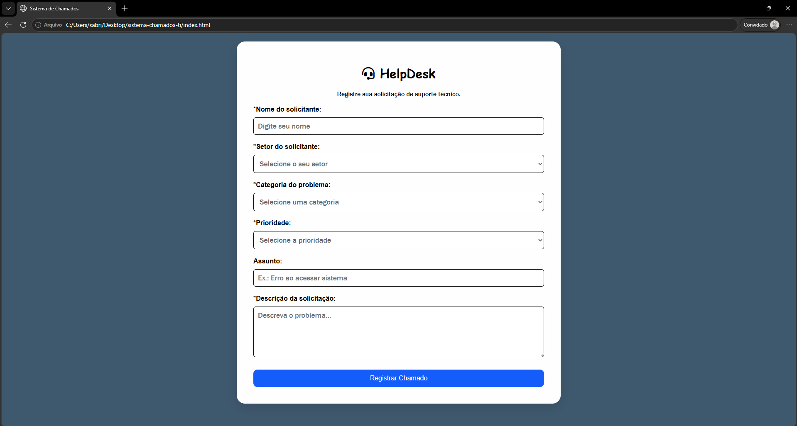
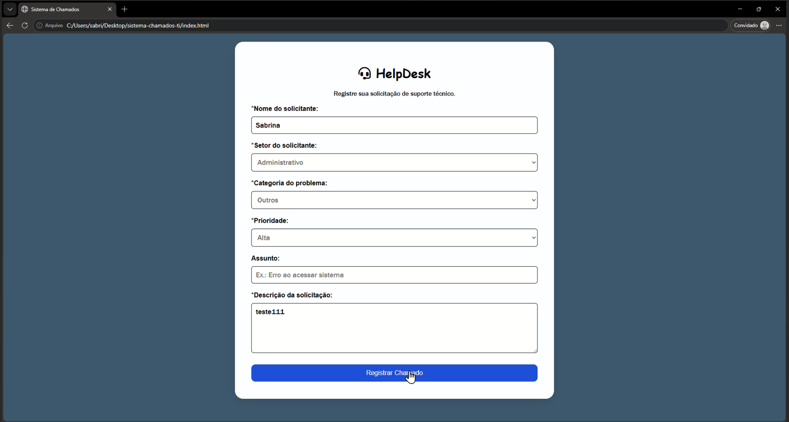
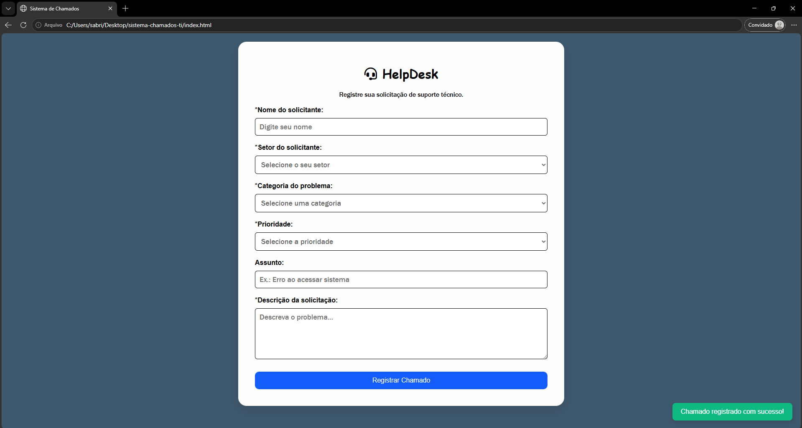

# Sistema Web de Chamados

Sistema web de abertura e registro de chamados de suporte técnico, desenvolvido com HTML, CSS, JavaScript, Node.js, Express.js e MySQL.

O projeto consiste em um sistema de Help Desk, permitindo que usuários registrem solicitações de suporte de forma organizada, informando dados como setor, categoria, prioridade, assunto e descrição do problema.

Os chamados são enviados para uma API desenvolvida em Node.js com Express.js e armazenados em um banco de dados MySQL.

## Acesso ao projeto

Você pode visualizar a interface do sistema:

https://sabrinaellendev.github.io/sistema-de-chamados/

## Tecnologias utilizadas

### Front-end

- HTML5
- CSS3
- JavaScript

### Back-end

- Node.js
- Express.js
- API REST

### Banco de dados

- MySQL

## Funcionalidades

- Abertura de chamados de suporte técnico
- Validação de campos obrigatórios
- Seleção de setor, categoria e prioridade
- Geração automática de status inicial do chamado
- Envio dos dados para uma API REST
- Armazenamento dos chamados em banco de dados MySQL
- Notificação visual de confirmação após o cadastro
- Limpeza automática do formulário após envio

## Funcionamento

O usuário preenche o formulário de abertura de chamado com as informações da solicitação.

O JavaScript do front-end captura os dados inseridos e realiza uma requisição utilizando Fetch para a API desenvolvida em Node.js.

A API recebe as informações, realiza a inserção dos dados no banco de dados MySQL e registra o chamado.

Cada chamado contém:

- ID
- Solicitante
- Setor
- Categoria
- Prioridade
- Assunto
- Descrição
- Status
- Data de abertura

## Objetivo

Este projeto foi desenvolvido com o objetivo de praticar conceitos de desenvolvimento Web Full Stack, criando uma aplicação com comunicação entre interface, API e banco de dados.

Conceitos aplicados:

- Estruturação de páginas com HTML
- Estilização de interfaces com CSS
- Manipulação do DOM
- Eventos em JavaScript
- Objetos e arrays
- Template Strings
- Consumo de API utilizando Fetch
- Criação de API REST com Express.js
- Integração com banco de dados MySQL
- Operações SQL de inserção de dados
- Organização de projetos front-end e back-end

## Demonstração do projeto

### Tela inicial

### Preenchimento do chamado

### Confirmação

